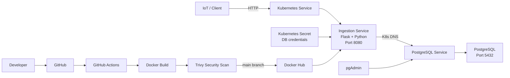

# 🚀 IoT Telemetry Microservices — Kubernetes POC


A hands-on **IoT telemetry ingestion platform POC** demonstrating how a containerized Python service can be deployed on Kubernetes and connect to PostgreSQL for backend validation.

The project demonstrates practical cloud-native patterns including **containerization, Kubernetes workload/service separation, environment-based configuration, secret-backed database credentials, health endpoints, database connectivity testing, CI validation, container vulnerability scanning, and Docker image publishing**.

## 🎯 What This POC Demonstrates

- Build and package a Python Flask service into a Docker image
- Deploy the application as a Kubernetes `Deployment`
- Expose the application through a Kubernetes `Service`
- Run PostgreSQL inside Kubernetes
- Store database credentials using a Kubernetes `Secret`
- Connect the application to PostgreSQL using environment-based configuration
- Validate application and database health through HTTP endpoints
- Manage PostgreSQL through pgAdmin
- Validate code and build the container automatically with GitHub Actions
- Scan the container image for HIGH/CRITICAL vulnerabilities with Trivy
- Publish the container image to Docker Hub after successful validation

## 🏗️ Architecture



### 🔄 Delivery Flow

```text
Developer
   │
   ▼
GitHub Push / Pull Request
   │
   ▼
GitHub Actions
   │
   ├── Python dependency install
   ├── Python syntax validation
   ├── Docker image build
   └── Trivy HIGH/CRITICAL scan
          │
          ▼
     Successful build
          │
          ▼
   Docker Hub image publish
          │
          ▼
 Kubernetes Deployment
          │
          ▼
 Flask Ingestion Service
          │
          ▼
 PostgreSQL
```

## 🧩 Project Structure

```text
iottelemetrymicroservices/
├── .github/
│   └── workflows/
│       └── ci-cd.yml            # CI/CD, image scan & Docker publish
│
├── app/
│   ├── app.py                  # Flask ingestion API
│   ├── Dockerfile              # Container image definition
│   └── requirements.txt        # Python dependencies
│
├── ingestion-deployment.yaml   # Kubernetes Deployment
├── ingestion-service.yaml      # Kubernetes Service
├── postgres-pod.yaml           # PostgreSQL workload
├── postgres-service.yaml        # PostgreSQL Service
├── postgres-secret.yaml         # Database credentials
├── pgadmin.yaml                 # pgAdmin workload/service
└── README.md
```

## 🔌 API Endpoints

| Endpoint | Purpose |
|---|---|
| `GET /` | Returns application name and running status |
| `GET /health` | Lightweight application health check |
| `GET /db-test` | Validates PostgreSQL connectivity and returns database/version information |

Example response from `/`:

```json
{
  "application": "Axion Ingestion Service",
  "status": "running"
}
```

The `/db-test` endpoint performs a PostgreSQL query using `current_database()` and `version()` and reports a `500` response when the database connection fails.

## ⚙️ Configuration

The application reads PostgreSQL connection settings from environment variables:

```text
POSTGRES_HOST
POSTGRES_PORT
POSTGRES_DB
POSTGRES_USER
POSTGRES_PASSWORD
```

In Kubernetes, the deployment injects database credentials from the `postgres-secret` Secret while using the Kubernetes service name `postgres-service` for service discovery.

> **Security note:** Do not commit real production credentials into Kubernetes manifests. For production deployments, prefer a managed secret solution such as a cloud secret manager, External Secrets, or sealed/encrypted secrets.

## 🐳 Build the Container

From the repository root:

```bash
docker build -t axion-ingestion:v1 ./app
```

The Dockerfile uses Python 3.12-slim and exposes application port `8080`.

Run locally:

```bash
docker run --rm -p 8080:8080 \
  -e POSTGRES_HOST=host.docker.internal \
  -e POSTGRES_PORT=5432 \
  -e POSTGRES_DB=appdb \
  -e POSTGRES_USER=postgres \
  -e POSTGRES_PASSWORD=<password> \
  axion-ingestion:v1
```

## ☸️ Kubernetes Deployment

Create the namespace used by the manifests:

```bash
kubectl create namespace axion
```

Apply PostgreSQL resources:

```bash
kubectl apply -f postgres-secret.yaml
kubectl apply -f postgres-pod.yaml
kubectl apply -f postgres-service.yaml
```

Deploy pgAdmin:

```bash
kubectl apply -f pgadmin.yaml
```

Deploy the ingestion service:

```bash
kubectl apply -f ingestion-deployment.yaml
kubectl apply -f ingestion-service.yaml
```

Verify workloads:

```bash
kubectl get pods -n axion
kubectl get svc -n axion
kubectl get deployments -n axion
```

## 🔍 Validate the Application

Check pod status:

```bash
kubectl get pods -n axion -o wide
```

Inspect application logs:

```bash
kubectl logs -n axion deployment/ingestion-service
```

Port-forward the application locally:

```bash
kubectl port-forward -n axion service/ingestion-service 8080:8080
```

Then test:

```bash
curl http://localhost:8080/
curl http://localhost:8080/health
curl http://localhost:8080/db-test
```

## 🔐 CI/CD & DevSecOps

The repository includes a GitHub Actions workflow at `.github/workflows/ci-cd.yml`.

### Pull Requests / Pushes

The pipeline performs:

1. Checkout source code
2. Configure Python 3.12
3. Install application dependencies
4. Run Python syntax validation
5. Build the Docker image
6. Scan the image using **Trivy** for HIGH/CRITICAL vulnerabilities

### Main Branch

After successful validation on `main`, the workflow logs into Docker Hub using GitHub Secrets and publishes:

```text
<DOCKERHUB_USERNAME>/axion-ingestion:<commit-sha>
<DOCKERHUB_USERNAME>/axion-ingestion:latest
```

Configure these repository secrets before enabling the publish stage:

```text
DOCKERHUB_USERNAME
DOCKERHUB_TOKEN
```

> **Recommendation:** Use a Docker Hub access token rather than a Docker Hub password, and keep credentials exclusively in GitHub Secrets.

## 🧪 Troubleshooting Flow

```text
Pod Running?
     │
     ├── No → kubectl describe pod / kubectl logs
     │
     ▼
Service Reachable?
     │
     ├── No → kubectl get svc / endpoints / port-forward
     │
     ▼
/health = healthy?
     │
     ├── No → inspect application logs
     │
     ▼
/db-test succeeds?
     │
     ├── No → verify Secret + PostgreSQL service + DB availability
     │
     ▼
Image vulnerable?
     │
     ├── Yes → review Trivy findings and rebuild
     │
     ▼
✅ Application → Kubernetes → PostgreSQL validated
```

## 🛠️ Technology Stack

| Layer | Technology |
|---|---|
| Application | Python, Flask |
| API | HTTP/JSON |
| Database | PostgreSQL |
| Database Admin | pgAdmin |
| Containerization | Docker |
| Orchestration | Kubernetes |
| CI/CD | GitHub Actions |
| Container Security | Trivy |
| Registry | Docker Hub |
| Configuration | Environment Variables |
| Secrets | Kubernetes Secret / GitHub Secrets |

## 💡 Production Engineering Roadmap

This POC can be evolved into a production-grade IoT platform by adding:

- Kubernetes liveness/readiness/startup probes
- Horizontal Pod Autoscaling
- Persistent volumes or managed PostgreSQL
- Ingress / API gateway
- TLS and network policies
- Prometheus + Grafana observability
- Centralized logging
- SBOM generation and image signing with Cosign
- Terraform-based infrastructure provisioning
- External secret management / workload identity
- GitOps deployment with Argo CD or Flux
- Event-driven telemetry ingestion using Kafka, Azure Event Hubs, or another streaming platform

## 📌 POC Scope

This repository focuses on **Kubernetes deployment and service-to-database connectivity validation**, with a lightweight CI/CD and container security pipeline.

It is not intended to represent a complete production IoT ingestion platform yet. The next evolution is to introduce actual telemetry persistence, asynchronous messaging, durable storage, observability, autoscaling, and stronger runtime security controls.

## 👨‍💻 Author

**Burhan Yousuf Wani**  
DevSecOps / Cloud Engineering | Kubernetes | Docker | Azure | Terraform

## ⭐ Why This Project Matters

This POC demonstrates the complete engineering path:

**Application Code → Docker → Security Scan → Container Registry → Kubernetes → Service Discovery → PostgreSQL**

It provides a practical foundation for modern **Cloud, DevOps, DevSecOps, Kubernetes, and platform engineering** workflows.

---

⭐ If you find the project useful, consider starring the repository and exploring the Kubernetes manifests and CI/CD workflow.
